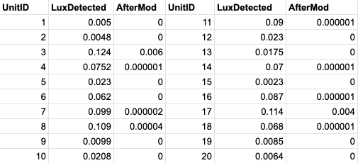
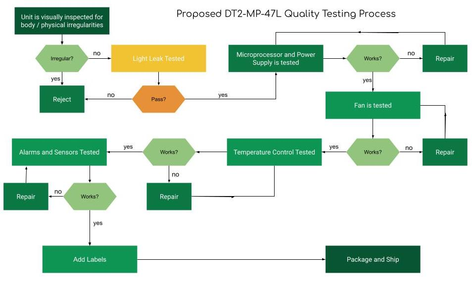

```{r setup, include=FALSE}
knitr::opts_chunk$set(echo = TRUE)
```

### Executive Summary:

Tritech Research is a Los Angeles based biology laboratory equipment manufacturing company that specializes in low-cost equipment for research institutions. The company's most popular product is the DT2-MP-47L, a temperature and light controlled incubator that stores cell cultures, Drosophila flies, and C. elegans specimens for experiments. These incubators are popular for their relative low-cost and smaller size compared to other incubators on the market.

{width=30%}

The incubator consists of four main components: The shell, or container, a microprocessor control unit, shelves, and labels. The container is a standalone product from IGLOO, the Iceless Portable Electric 40 Qt Cooler, and includes a power supply and built-in fan. The microprocessor control unit is manufactured by Tritech Research, and controls temperature, lights, and has sensors that alert when conditions are outside of experiment parameters. The shelves and labels are also manufactured at Tritech Research. Additional customizable features, such as tubing holes or LED light panels, can be added to the incubator for additional cost.

Between 2014 through 2018, Tritech Research sold an average of 534 units of DT2-MP-47L incubators annually, which accounts for around 28% of the annual gross sales of the company. The company maintains a non-return policy for all sales except in the case of a product defect.

Between the years of 2014-2017, the average number of incubators returned was 2.5 units annually, or about .5% of units sold.

In 2018, the number of defective returns of the DT2-MP-47L, increased significantly to 23 units, or 4% of units sold. 

This report will examine the root cause of the increase in defective units along with the efficacy of the proposed solutions to reduce the number of defective units.  

Between 2014 and 2018, a total of 33 defective product claims were filed for customers who purchased units of DT2-MP-47L, and each defective product claim received a record of the defect as stated by the customer and was subsequently examined to identify the cause of the defect. For the defects that occurred in incubators manufactured between 2014 through 2017, the primary defects were related to issues in the microprocessor control unit or damage incurred in shipping. However, the data from 2018 shows that the most frequently occurring defect was related to the light leakage through the product during circadian experiments. The customer's claims were corroborated through extensive testing of each defective unit with an ultra-sensitive photometer able to detect sensitivity of 0.000001 lux. Each of the defects exhibited a light leakage well outside of acceptable standards.

The issue of the light leakage would have a significant impact upon Tritech Research's revenues as the DT2-MP-47L incubator sales account for 28% of gross sales. Additionally, the company relies on repeat customers and referrals in lieu of marketing, and failure to correct the product could impact sales in other departments, particularly if the defect results in faulty experiments resulting in unreproducible or inconsistent research findings. 

A project plan was created to identify and resolve the issues by utilizing the Six Sigma DMAIC problem solving process to examine ways to reduce the number of defective incubators produced. We first surveyed the supply warehouse to get a count of the proportion of IGLOO coolers that exhibited light leakage. We then assessed possible solutions and designed an experiment to evaluate the efficacy of the proposed solutions. From this study, we were able to identify several possible courses of action to reduce the number of defect claims.

A major finding in this project is the addition of a new component of synthetic fabric to the product would reduce the light leaking into the incubator from an average of 0.05 lux to 0 lux. Several versions of the product were tested, and all results showed a significant reduction of the issue. Although the addition of the new component would increase the cost of production by about $20.00 per unit, or around 4%, the benefit of retaining the customer base and encouraging confidence in the product outweigh the additional cost, and allows the company to continue to produce incubators in small batches without investing in mass production and storage. 

\newpage
## 1.0 IMPROVEMENT OPPORTUNITY: DEFINE PHASE

\textcolor{white}{spacer}


### 1.1 Problem Statement
Since 2018, there have been an increased number of returned defective units, resulting in loss of revenues, customer confidence, and significant waste, as the returned products are unable to be repurposed or resold.
Although the net profit of each unit sold is 800 USD, each returned defective unit results in an average net loss of approximately 500 USD (labor and materials). The goal of this project is to reduce the amount of defective units to the established levels before 2018. 

### 1.2 Voice of Customer
The DT2-MP-47L incubator is the most popular product in Tritech Research's product line, accounting for 28% of the company's gross revenue. Tritech Research's incubator customer base is comprised of academic researchers whose critical-to-quality (CTQ) characteristics are as follows:

1) Functionality: Controllable temperature and light level
2) Cost efficiency for laboratory budget restraints
3) Accuracy
4) Time to delivery
5) Easy to use

Customers of the DT2-MP-47L incubator primarily use the incubator for experiments that require temperature control, light control (for circadian experiments), or both. A survey of 400 customers during the product development phase showed that customers were primarily concerned with functionality, cost efficiency, and accuracy with near equal importance, followed by delivery times and ease of use. In contrast, factors such as product weight and aesthetics were rated the least important. The majority of customers are Principal Investigators in academic research who use the incubator to conduct biological experiments and greatly value accuracy and reliability. In other words, DT2-MP-47L customers want the product to function as advertised and show no variation in its functionality.

\textcolor{white}{spacer}
\textcolor{white}{spacer}
\textcolor{white}{spacer}
\textcolor{white}{spacer}


{width=60%}


\textcolor{white}{spacer}
\textcolor{white}{spacer}
\textcolor{white}{spacer}

### 1.3 Product Order-to-Fulfillment Information
Each DT2-MP-47L unit is assembled upon order, although its components are pre-sourced or pre-fabricated and stored in the warehouse. The customer also has the option to order custom features, such as drilled holes or installed with LED panels.  

The flowchart of the manufacturing process is shown below:

\textcolor{white}{spacer}
\textcolor{white}{spacer}
\textcolor{white}{spacer}

```{r, echo=FALSE, warning=FALSE, }
library(SixSigma)

inputs.overall<-c("Components", "Prod. Engineer", "Office Mgr")
outputs.overall<-c("DT2-MP-47L")
steps<-c("Compile", "Assembly", "Test", "Package")
#Inputs of process "i" are inputs of process "i+1"
input.output<-vector(mode="list",length=length(steps))
input.output[1]<-list(c("Main Components", "Accessories"))
input.output[2]<-list(c("Igloo Cooler", "Microprocesser"))
input.output[3]<-list(c("DT2-MP-47L"))
input.output[4]<-list(c("Logo Decal", "Accessories", "Box"))

#Parameters of each process
x.parameters<-vector(mode="list",length=length(steps))
x.parameters[1]<-list(c(list(c("Warehouse", "C")),list(c("Update Inventory", "P"))))
x.parameters[2]<-list(c(list(c("Prod. Engineer", "C")),list(c("Tools", "C"))))
x.parameters[3]<-list(c(list(c("Prod. Engineer", "C")),list(c("Electricity", "N"))))
x.parameters[4]<-list(c(list(c("Office Mgr", "C")),list(c("Ship", "P"))))

#Features of each process
y.features<-vector(mode="list",length=length(steps))
y.features[1]<-list(c(list(c("Count", "Cr"))))
y.features[2]<-list(c(list(c("Affix", "Cr"))))
y.features[3]<-list(c(list(c("Works", "Cr"))))
y.features[4]<-list(c(list(c("Correct", "Cr"))))

ss.pMap(steps, inputs.overall, outputs.overall,
        input.output, x.parameters, y.features, 
        main="DT2-MP-47L Assembly Process", sub="SIPOC Diagram of DT2-MP-47L Process")
```


\textcolor{white}{spacer}
\textcolor{white}{spacer}
\textcolor{white}{spacer}

  Once the order is received, the Warehouse gathers the pre-fabricated components and sends the parts to Engineering for assembly. Once the product is assembled, the product is tested for quality control. In this process, the unit is checked to ensure that all components are assembled correctly, and the microprocessor is tested to ensure functionality of temperature controls and alarms before the product and its accessories are then packaged, labeled, and shipped by the Office personnel. A flowchart of the current testing process is shown in figure 3. \newpage


\textcolor{white}{spacer}
\textcolor{white}{spacer}
\textcolor{white}{spacer}

One important thing to note is that the current quality testing process does not include a test to determine whether the unit exhibits transparency in the material, which is possibly the reason why the number of units with light leakage were undetected prior to shipping. We will explore this issue further in the Analyze phase of this project.


#### Define Phase Tollgates\newline

\textcolor{white}{.}

\textcolor{blue}{1) Does the problem statement focus on symptoms, and not on possible causes or solutions?}

\textcolor{blue}{2) Does the problem present a significant financial loss for the company?}

\textcolor{blue}{3) Does the problem present a significant problem to the reputation of the company?}

\textcolor{blue}{4) Has a SIPOC diagram or other high-level process map been completed?}

\textcolor{blue}{5) Has a goal for the project been identified?}

\textcolor{blue}{6) Have any obvious barriers or obstacles to successful completion of the project been ignored?}


\textcolor{white}{spacer}
\textcolor{white}{spacer}
\textcolor{white}{spacer}

**Assuming that all of the tollgates have been passed, the project can move forward to the Measure phase.**


\newpage

## 2.0 CURRENT STATE OF THE PROCESS: MEASURE PHASE

### 2.1 Types of Defective Return Claims

We examined each of the cases that resulted in defective item return claims between 2014 and 2018 and identified the primary reasons customers provided in their defective return claims.

\textcolor{white}{spacer}
\textcolor{white}{spacer}
\textcolor{white}{spacer}

```{r, echo=FALSE, warning=FALSE, message=FALSE}
library(qcc)
cause.and.effect(cause=list(Container=c("Broken Fan", "Light Leak", "Irregular"),
                            Microprocessor= c("Short Circuit", "Programming Error", "Faulty Power"),
                            CustomFeature =c("Incorrect", "Missing"),
                            Shipping=c("impact", "water damage")),
                 effect = "Defective Unit Return Claim")
```

\textcolor{white}{spacer}
\textcolor{white}{spacer}
\textcolor{white}{spacer}

The above cause-and-effect diagram illustrates the various defects that result in a successful defective item claim. Each defect is grouped in the component or process that is affected. The defects that occur in the component variables: Container, Microprocessor, Custom Feature are able to be addressed during production, and the defects that occur from shipping damage will need to be addressed separately as they are chance/special cause variations that occur when the product is outside of the custody of the company. Similarily, a short circuit in the microprocessor is considered a special case if the event occurs when the product is outside of the custody of the company.

**Assignable Issues**

Broken Fan - Light Leak - Irregular Container - Programming Error - Faulty Power Supply - Missing Custom Feature - Incorrect Custom Feature


**Common/Special Case Issues**

Impact Damage (shipping) - Water Damage (shipping) - Short Circuit (Customer)\newpage

### 2.2 Frequency of Defective Return Claims


The Check Sheet in Figure 4 shows the number of DT2-MP-47L return claims received between January 1, 2014 and February 28, 2019. 
We observed that the number of claims increased significantly in the year 2018 and upon further investigation, we identified that the increase in defective claims began during August of 2018, remaining higher than previous averages throughout the rest of 2018, as shown in Figure 5. 


Narrowing the range of dates to the year of 2018 showed that the increase in defective claims began approximately in August of 2018, which narrowed down the batches of DT2-MP-47L that were affected. Production records for these batches were retrieved from the records and a review was conducted to examine the cause and scope of the increase in defective units.\newpage

In order to reduce the number of claims to the levels prior to 2018, we first defined the control limits for an acceptable number of defects produced in the production process of the DT2-MP-47L by calculating the annual ratio of defective products sold between 2014 through 2017.

{width=50%}


We establish our target ratio at .48% ± 0.27% as the limits for acceptable rate of defect return claims for an annual average of 538.75 units produced.  In 2018, 518 units of DT2-MP-47L were sold, which allowed us to establish the target for 2018 at 2.4864 defective units with a standard deviation of 1.3986. This provides us with an upper limit of 3.885 defective units and a lower bound of 1.0878. We round these figures to 4 units and 1 unit, although we ignore the lower bound of this range as it would be desirable to have zero defective units if possible.

The graphic below shows a simple plot that depicts the frequency of the type of errors found. The furthest outlier belongs to the point associated with light leak defects (LL), while two other points associated with container damage (CD) and microprocessor damage (MD) show a greater than average frequency. 


```{r, echo=FALSE, warning=FALSE}
library(qcc)
library(readxl)
library(ggplot2)

data.defects<-read_excel("defect.xlsx", range = "B1:C11")
ggplot(data.defects, aes(DefectCode, NumOfUnits))+
  geom_point()+
  xlab("Defect Type")+
  ylab("Number of Units")+
  ggtitle("2014-2018 DT2-MP-47L Defect Count")

```

\textcolor{white}{blank}
\textcolor{white}{blank}

{width=50%}

### 2.3 Identification of Key Variables

So far we have established that a large proportion of the increase in defective unit return claims occur from a defect in the container component of the DT2-MP-47L that causes partial transparency, allowing light to leak into the incubator. Therefore, one important KPOV of the DT2-MP-47L is the opacity of the incubator, which is directly influenced by the KPIV of the container component. Another KPIV for this KPOV would be the quality testing process, which is designed to catch all defects of the DT2-MP-47L before it ships to the customer. 

Aside from light-leak, the second and third most common reasons for defective unit return claims are container damage and microprocessor damage, which are incurred through the shipping process. Although shipping damage is insured, a replacement unit must be added to the production queue, which can become a potential bottleneck in the production process, and thus it is worth considering improving packing materials to minimize such instances. Thus, we could consider the DT2-MP-47L unit to be a potential KPOV, with the packaging as its corresponding KPIV. 

Other reasons for defective unit return claims arise from other component failures which affect the operability of the DT2-MP-47L, which is the third selected KPOV. The corresponding KPIV would be the quality testing process, as it will identify the parts needing to be repaired or replaced prior to shipping the unit to the customer.

#### Measure Phase Tollgates\newline

\textcolor{white}{.}

\textcolor{blue}{1) Has the problem been measured in scope and scale?}

\textcolor{blue}{2) Does the data support the case for improvement?}

\textcolor{blue}{3) Have the KPIV and KPOV been identified?}

\textcolor{blue}{4) Does the data provide a basis to create a target performance level?}

\textcolor{blue}{5) Has a target performance level been identified?}


\textcolor{white}{spacer}
\textcolor{white}{spacer}
\textcolor{white}{spacer}

**Assuming that all of the tollgates have been passed, the project can move forward to the Analyze phase.**


\newpage

## 3.0 ANALYSIS AND FINDINGS: THE ANALYZE PHASE

### 3.1 Classification and Prioritizing Defects

In this phase, we focus on evaluating the cause of the defects and selecting the opportunities to target for improvement. We begin with a look at a Pareto chart of the types of defective unit return claims.

```{r, echo=FALSE, warning=FALSE}
# Create a vector of the defects

DT2_defects <- c(6, 1, 24, 0, 5, 2, 1, 1, 0, 1)
# Create a vector of the names of the defects
names(DT2_defects) <- c("Container Damage", "Fan Failure", "Light Leak", "Irregular Temperature", 
                         "Microprocessor Damage", "Power Supply", "Programming Error", "Sensor Failure", "Alarm Failure", "Custom Feature Issue")
# Create the Pareto Chart
pareto.chart(DT2_defects,
             ylab="Frequency",
             ylab2 = "Cumulative Percentage",
             main = "Pareto Chart for DT2-MP-47L Defect Claims",
             cumperc = seq(0, 100, by=20))
```


We observe from the chart that the light leak defect is the cause of the defective return claims in 70% of the cases. We thereby establish that it takes the highest priority in this project in order to reduce the number of defective return claims.

In order to prioritize the rest of the issues for improvement, we created a demerit system to identify the issues that have the greatest effect on both the customer and the business. From the customer's perspective, all defects are equally undesirable and have equal chance of disrupting or invalidating their research findings, so greater weight was given to how much loss would be generated from defects. 

**Class A Defect - Very Serious - 100** The defect results in maximum loss. More than 1 component is affected and/or no component can be salvaged. Shipping insurance will not offset costs. Materials cost cannot be offset by a claim with the supplier.

**Class B Defect - Serious - 50** The defect results in significant loss. One component can be salvaged or loss is offset by shipping insurance or claim with supplier.

**Class C Defect - Moderately Serious - 10** The defect results in moderate loss. One component can be salvaged and loss is offset by shipping insurance or claim with supplier OR more than one component can be salvaged.

**Class D Defect - Minor - 1** The defect results in some loss. Most components can be salvaged and cost is able to be offset by shipping insurance or claim with supplier.

{width=60%}

After considering the impact of the various defective unit causes and their frequency of occurrence, we established a recommendation of priority for improvement:

1) Light Leak\textcolor{white}{.......................................}**Raw Material Issue**
2) Container Damage (Shipping)\textcolor{white}{.........}**External Procedural Issue**
3) Microprocessor Damage (shipping)\textcolor{white}{.}**External Procedural Issue**
4) Custom Feature Issue\textcolor{white}{......................}**Internal Procedural Issue**
5) Irregular Temperature Control\textcolor{white}{........}**Internal Procedural Issue**
6) Sensor Failure\textcolor{white}{..................................}**Internal Procedural Issue**
7) Programming Error\textcolor{white}{.........................}**Internal Procedural Issue**
8) Alarm Failure\textcolor{white}{..................................}**Internal Procedural Issue**
9) Power Supply\textcolor{white}{.. ...............................}**Internal Procedural Issue**
10) Fan Failure\textcolor{white}{......................................}**Internal Procedural Issue**

The project team further categorized the issues into three categories: Raw Material Issue, External Procedural issue, and Internal Procedural issue.

**Raw Material Issue** - Problem occurs in raw material. Possible solutions are: Supplier change, Design Change

**External Procedural Issue** - Problem occurs in vendor process. Possible solutions are: Switch vendor, improve packaging materials

**Internal Procedural Issue** - Problem occurs at internal process. Possible solutions are: Improve training, improve quality test.

### 3.2 Analysis of the Light Leak Defect

A test was conducted with 20 defective DT2-MP-47L units that were returned, along with a control group of 20 units from a batch in 2016. An ultra-sensitive photometer was placed inside the DT2-MP-47L to record light that leaked through. A light lamp emitting 10000 lux was placed 1cm away from each side of the unit for 30 seconds per side, and the findings were recorded.

{width=80%}

The data indicates that the defect occurs at the front of the container, through the white door of the unit. We contacted the supplier IGLOO who confirmed that they had switched to a new pigment material in 2018, which is likely the cause of the change in characteristic. 


{width=75%}

\newpage

Another test was conducted at the warehouse to determine how many of the containers were affected. There are 250 containers being stored. Of these containers, we discovered that 25 containers had doors that leaked light, signalling that about 10% of the current stock were non-conforming to standards. Aside from the existing stock, Tritech Research received a shipment of 20 containers every week. Testing of subsequent shipments over a period of 10 weeks yielded information that the proportion of non-conforming containers is 0.07, or 7%.

### 3.3 Identifying Actionable Solutions

Project personnel inquired with the supplier whether they could eliminate non-conforming doors in their shipments to Tritech Research, but the supplier declined, citing that the product is in fact, a consumer level cooler designed to hold beverages and not scientific experiments, and product shipment batches are randomized. They are unwilling to accept returns of containers found to be nonconforming to Tritech's standards for the same reason. We explored the option of switching suppliers, but no suitable replacement is available (no product exists that meets our specifications) and the cost of manufacturing is prohibitive. Thus, the solutions that remained viable were to redesign the product or to improve the DT2-MP-47L's quality testing process. 

The information from the supplier allowed our team to revise the classification of common/assignable causes as such:

**Common/Special Cause**

Light-Leaking Door

Irregular Container (Not Light Leak)

Container Damage (Shipping)

Microprocessor Damage (Shipping)

Short Circuit (Customer)
\newline

**Assignable Cause**

Broken Fan

Irregular Container 

Programming Error

Faulty Power Supply

Missing Custom Feature

Incorrect Custom Feature
\newline

We next explore the remaining potential solutions: 

#### Redesign option:
An idea for eliminating the light-leak defect is to add the component of a synthetic fabric to the product that would reduce the light leaking into the incubator from an average of 0.05 lux to 0 lux. Several versions of the fabric were tested on defective units, and all result in a significant reduction of the issue, depending on the initial degree of defect present. For containers that leak less than 0.01 lux, we found that the modification would completely eliminate the nonconformity. For containers that exhibit greater than 0.01 lux, none of the fabrics were able to reduce the light leakage to the required specification. 

The addition of the new component would increase the cost of production by about $20.00 per unit, or around 4%. In considering whether to pursue this option, factors to consider would be the benefit of reducing loss generated from defective returns weighed against the additional cost of implementation. 




#### Testing process change:
During the Define phase, we provided an overview of the current quality control testing process that is implemented during the DT2-MP-47L assembly (Figure 3, pg. 5). The currently implemented test does not include a procedure to detect light leak defects. One option to explore is adding a light test to catch the error at this stage of the DT2-MP-47L process. Another benefit of this option is that current quality check employees would be retrained for the new step in the process, which has the potential to refresh their knowledge and improve their performance in catching other defects in other steps of the process.



#### Combination of redesign and testing process change:
We can also combine the two solutions and implement the new component if the unit is determined to exhibit light leak at the time of the testing process. That is, rather than rejecting the unit after it fails the test, it can be modified by gluing the synthetic fabric to the door of the unit. 

### 3.4 Analysis of Shipping Damage Issue

The number of units damaged while in transit to the customer numbered at 11 units. Upon reviewing the records, it was discovered that 10 of the 11 units were part of the same order to a single customer, who had ordered 12 incubators. We contacted the vendor at FEDEX and subsequently learned that the incident was due to an accident that occurred on the cargo ship after a large pallet was dropped from a crane.

As the issue occurred from a chance accident, upper management has determined that no further action will be taken on the issue of defects that occur during transit for this project.

### 3.5 Other Defects

A possible solution for reducing or eliminating the other causes of defective units is to retrain the quality-check personnel, given that the defects do not occur at a high rate. It is therefore suggested that further analysis of other defects be put on hold until the issue of the light leak defect has been addressed. As mentioned in section 3.3, the solution in implementing a new step in the DT2-MP-47L Quality Test would result in a retraining of Quality Testing personnel, which may eliminate the need for further review.


#### Analyze Phase Tollgates\newline

\textcolor{white}{.}

\textcolor{blue}{1) What opportunities are going to be targeted for investigation in the Improve step?}

\textcolor{blue}{2) Are there other opportunities that will not be further evaluated?}

\textcolor{blue}{3) Have sufficient justifications been provided?}

\textcolor{blue}{4) Which solutions are approved for investigation by Upper Management?}


\textcolor{white}{spacer}
\textcolor{white}{spacer}
\textcolor{white}{spacer}

**Assuming that all of the tollgates have been passed, the project can move forward to the Improve phase.**
\newpage

## 4.0 RECOMMENDATIONS: THE IMPROVE PHASE

In this phase, the project is focused on exploring the viability of the possible solutions to eliminate the light-leak defect in DT2-MP-47L models. From the previous phases, we have learned that approximately 10% of the current supply of containers is affected by the non-conformity, and that an average of 7% of the weekly shipments are affected.

We found three possible solutions to explore in the previous phase, and implemented tests to determine the viability of the solutions in reducing the number of defective return claims by customers.

### 4.1 Redesign Option - Add Component

We sourced several different double sided fabrics that are typically in screen projectors and glued them to the defective areas of units that were returned by customers. The supplier is able to provide them pre-cut to specifications for no additional cost, which expedites the process of having to measure and cut the fabric for the assembly team. Timed trials of gluing the fabric to the container were conducted, with the average processing time being 18 minutes. 20 defective containers that exhibited light leaks ranging from 0.0023 lux to 0.124 were tested to establish its degree of nonconformity, modified with the fabric and retested for light leaks. Each unit was assigned a Unit ID ranging from 1-20 and tested 6 times over a period of three days. 3 of the tests were conducted without modification, and the remaining three tests were conducted after product modification.


```{r, echo=FALSE, warning=FALSE}
library(qcc)
library(readxl)

luxtest <- read_excel("Lux Test.xlsx", range = "U1:V61")
lux.data <- with(luxtest, qcc.groups(`LuxDetected`, `UnitID`))
c1<- qcc(lux.data, type="xbar", center = 0, std.dev = 0.05773505, rules = NA, data.name = "Degree of Light Leak", title="Measured Lux before Modification")

```

Above is a control chart depicting the average degree of light leak exhibited by each of the 20 tested incubators prior to modification. We set our target (center) at 0, and allowed for 0.05773505 standard deviation in order to establish the upper control limit at 0.10 lux, which was the maximum degree of nonconformity that could be addressed by the modification. We utilize this chart to visualize which numbered units consistently failed the light leak test after modification and we are only interested in the points beyond the upper control limit line (UCL).

The results of the trial showed a significant reduction of light leak for each defective incubator. 17 out of 20 units showed light leak levels within target limits of < 0.000001 lux, while the three units exhibiting points outside of the UCL (#3, #8, #17) remained outside of control limits. 

Potential issues that arise for implementing the solution is that not all containers show the non-conformity, and adding the additional component as a standardized procedure could result in unnecessary expenditure of resources. The projected unit cost of modification is 20USD including materials and labor. We therefore need to compare the cost of implementation along with the losses incurred from the issue.


We observe that the returned units resulted in a loss of 12,000 USD. From the table in Figure 6 (page 8), we know that the average number of DT2-MP-47L units sold annually is approximately 534 units, and project that 7% of the units, or approximately 38 units would show the defect. If no action is taken in reducing the number of defective units, the loss incurred would be calculated at 38(600) = 22,800 USD. If we proceed with modifying every unit, the cost would run 534(20) = 10,680 USD.

### 4.2 Testing Process Modification Option

We next examine modifying the current quality testing process to include a test for light leaks. Testing for the light leak requires personnel who are able to operate a photometer to conduct the test. As other components must be tested in the same process, the individual will also need to have a general understanding of basic engineering and electrical concepts. A trial run of the proposed testing process was implemented to determine its effect in detecting defective items prior to shipment and continues to remain in place to present.

The operator of the quality test was instructed to include the new step outlined in Figure 12 (page 15) to test the DT2-MP-47L units for light leaks. An ultra-sensitive photometer able to detect at a sensitivity of 0.000001 lux was placed inside the containers and recorded its findings. The unit is exposed to sunlight, along with a 10000 lumen light lamp placed directly in front of the defect concentration area. The measurement is taken three times and recorded, and any unit that registers above 0.000002 lux is rejected. 

Prior to adding the new step, the Processing Time (PT) for the quality testing process was 180 minutes. We found that the new step added an average of 18-20 minutes to the process, increasing the PT by 11%. However, the effect on total lead time (LT) did not create any significant bottlenecks.

Potential issues that would arise from implementing this option center around the amount of waste generated by defects in the supply of containers as they cannot be returned to the supplier for light leaks. Although the net loss from defective units are reduced from an average of 600 USD to 400 USD per unit if non-conforming units are detected prior to shipping, the loss incurred from materials and labels remains a significant factor for consideration. \newpage


### 4.3) Combination of Design Modification and Process Modification

This report finds that a combination of the above solutions provides the best chance for reducing the number of defective unit claims and increasing customer confidence in the product. We find that implementing the modification as a repair step immediately after the quality testing would allow only the 7-8% of non-conforming containers to be modified, which would reduce the cost while simultaneously reducing the opportunity for defective DT2-MP-47L to be shipped to the customer. Additionally, retraining the quality testing personnel has resulted in improving the process in detecting other defects during the trial phase. A retraining program may also be instituted as part of an Out-of-Control Action Plan (OCAP). 

{width=60%}

### 4.4) Recommendation of Action

The recommendation of this report is to institute the combination option of including a test for light leaks in the quality testing phase of the DT2-MP-47L production process based on cost/benefit parameters established in this study. The combination option simultaneously deals with both the problems of financial loss generated from waste and customer satisfaction.


#### Improve Phase Tollgates\newline

\textcolor{white}{.}

\textcolor{blue}{1) Have the proposed actionable plans been tested?}

\textcolor{blue}{2) Has a cost projection been included?}

\textcolor{blue}{3) Has a recommendation been made for a course of action?}

\textcolor{red}{4) Has Upper Management approved the recommended course of action?}


\textcolor{white}{spacer}
\textcolor{white}{spacer}
\textcolor{white}{spacer}

**Assuming that all of the tollgates have been passed, the project can move forward to the Control phase.**
\newpage


## 5.0 MONITORING AND CONTROL: THE CONTROL PHASE

From this study, we found that we were able to reduce the waste generated by the light-leak defect through implementing a modified quality check test and designing a modification process to bring the unit's performance within specification limits. The current annual average of DT2-MP-47L units sold is 534, and is projected to increase by 5% per year. The goal of our project was to return the number of DT2-MP-47L defective unit claims to levels prior to 2018 to 0.48%. Future improvements could center around narrowing the proportion of defective units to 5-sigma level. 

### 5.1 Establishing Control Limits

Based on historical data between 2014-2017, we established that the range of acceptable proportion of customer return claims for the DT2-MP-47L is at 0.48% ± 0.27% of units sold. This limit should be re-evaluated every few years to reflect the goals of upper management. 

Going forward, we project that the supplier will continue to provide shipments that contain 7-8% of non-conforming containers. We recommend that the DT2-MP-47L quality check process is documented and each incident of defects should be carefully recorded and audited every quarter to detect any change from our projection. 

We also recommend that administrative / accounting personnel monitor the number of customer complaints and defective return claims through a Customer Relationship Management (CRM) program and produce a quarterly report to upper management. Statistical analysis software should be regularly implemented to detect shifts from the established control limits. Significant variations from expected metrics should be immediately reported and the Out-of-Control Action Plan (OCAP) should be implemented.

### 5.2 Out-of-Control Action Plan

We designed an Out-of-Control Action Plan to address shifts in process control. Administrative operators will monitor the number of defective return claims along with customer feedback, and Engineering operators will monitor quality testing data to ascertain whether the process is out of control.

{width=75%}

\newpage

For upper management, we created the following OCAP.

{width=75%}

Upper management will exercise discretion regarding issues that present a disruption to company reputation or present a hazard for loss. Customer feedback should be monitored and reviewed annually to investigate opportunities of additional revenue through product improvement or new product design.


### 5.3 Performance of Implemented Solution

After the new procedures were implemented, a review process was conducted. The findings show that defective return claims of DT2-MP-47L units were reduced to ZERO within 60 days of implementing the new procedure and remained at ZERO for 90 days following. One defective return claim was processed for an issue unrelated to light leak at the 180 day mark. These results confirm our previous theory that the retraining program is beneficial in reducing the number of non-conforming units sold to customers, thereby reducing the number of defective return claims.

\newpage

## 6.0 Conclusion

The number of defective return claims for the DT2-MP-47L increased significantly in 2018, causing a team to be assembled to investigate the matter and find a solution utilizing Six-Sigma principles. The problem was successfully identified and measured in scope, and possible solutions were identified through careful analysis. 

The solution was a combination of proposed solutions: adding a test to detect non-conforming levels of light leaks in the container, and a product modification step to "repair" the defect upon detection. The total cost of the solution was estimated to be around 3204.00 USD and the actual cost has been 3400.00 USD, staying within reasonable range of our estimation. 

Successful trials of the solutions resulted in official implementation of the problem and the targeted goal of reducing the number of defective return claims was attained and maintained. Retraining of quality check personnel has contributed to metrics that have surpassed the initial goal as evidenced by the fact that 2019 had only one defective return claim of DT2-MP-47L.

An out-of-control plan was created for both support personnel and upper management in order to detect shifts in process performance and provided to the appropriate departments. 

Our final recommendation in the interest of future improvement opportunities is for all departments to keep detailed logs of operation and increase the input from customer feedback in product design.


\newpage

# (APPENDIX) R CODE {-} 

## SIPOC Diagram (Page 4)

```{r, echo=TRUE, warning=FALSE, eval=FALSE}
library(SixSigma)

inputs.overall<-c("Components", "Prod. Engineer", "Office Mgr")
outputs.overall<-c("DT2-MP-47L")
steps<-c("Compile", "Assembly", "Test", "Package")
#Inputs of process "i" are inputs of process "i+1"
input.output<-vector(mode="list",length=length(steps))
input.output[1]<-list(c("Main Components", "Accessories"))
input.output[2]<-list(c("Igloo Cooler", "Microprocesser"))
input.output[3]<-list(c("DT2-MP-47L"))
input.output[4]<-list(c("Logo Decal", "Accessories", "Box"))

#Parameters of each process
x.parameters<-vector(mode="list",length=length(steps))
x.parameters[1]<-list(c(list(c("Warehouse", "C")),list(c("Update Inventory", "P"))))
x.parameters[2]<-list(c(list(c("Prod. Engineer", "C")),list(c("Tools", "C"))))
x.parameters[3]<-list(c(list(c("Prod. Engineer", "C")),list(c("Electricity", "N"))))
x.parameters[4]<-list(c(list(c("Office Mgr", "C")),list(c("Ship", "P"))))

#Features of each process
y.features<-vector(mode="list",length=length(steps))
y.features[1]<-list(c(list(c("Count", "Cr"))))
y.features[2]<-list(c(list(c("Affix", "Cr"))))
y.features[3]<-list(c(list(c("Works", "Cr"))))
y.features[4]<-list(c(list(c("Correct", "Cr"))))

ss.pMap(steps, inputs.overall, outputs.overall,
        input.output, x.parameters, y.features, 
        main="DT2-MP-47L Assembly Process", sub="SIPOC Diagram of DT2-MP-47L Process")
```


## Cause and Effect Diagram (Page 6)
```{r, echo=TRUE, warning=FALSE, message=FALSE, eval=FALSE}
library(qcc)
cause.and.effect(cause=list(Container=c("Broken Fan", "Light Leak", "Irregular"),
                            Microprocessor= c("Short Circuit", "Programming Error", "Faulty Power"),
                            CustomFeature =c("Incorrect", "Missing"),
                            Shipping=c("impact", "water damage")),
                 effect = "Defective Unit Return Claim")
```

\newpage

## 2014-2018 DT2-MP-47L Defect Count (Page 8)

**Data: defect.xlsx**

https://docs.google.com/spreadsheets/d/1pJABUGj123BuAKg5wvLcQMAcN9uRPtYoTR6frZHV5D4/edit?usp=sharing

```{r, echo=TRUE, warning=FALSE, eval=FALSE}
library(qcc)
library(readxl)
library(ggplot2)

data.defects<-read_excel("defect.xlsx", range = "B1:C11")
ggplot(data.defects, aes(DefectCode, NumOfUnits))+
  geom_point()+
  xlab("Defect Type")+
  ylab("Number of Units")+
  ggtitle("2014-2018 DT2-MP-47L Defect Count")

```

## Pareto Chart for DT2-MP-47L Defect Claims (Page 10)

```{r, echo=TRUE, warning=FALSE, eval=FALSE}
# Create a vector of the defects

DT2_defects <- c(6, 1, 24, 0, 5, 2, 1, 1, 0, 1)
# Create a vector of the names of the defects
names(DT2_defects) <- c("Container Damage", "Fan Failure", "Light Leak", "Irregular Temperature", 
                         "Microprocessor Damage", "Power Supply", "Programming Error", "Sensor Failure", 
                        "Alarm Failure", "Custom Feature Issue")
# Create the Pareto Chart
pareto.chart(DT2_defects,
             ylab="Frequency",
             ylab2 = "Cumulative Percentage",
             main = "Pareto Chart for DT2-MP-47L Defect Claims",
             cumperc = seq(0, 100, by=20))
```


## Measured Lux before Modification -Customized Control Chart (Page 16)

**Data: Lux Test.xlsx**

https://docs.google.com/spreadsheets/d/18D_BVgb0ODdSEthn_J4RWC75K_GGqSilfy6W3FBBqDE/edit?usp=sharing

```{r, echo=TRUE, warning=FALSE, eval=FALSE}
library(qcc)
library(readxl)

luxtest <- read_excel("Lux Test.xlsx", range = "U1:V61")
lux.data <- with(luxtest, qcc.groups(`LuxDetected`, `UnitID`))
c1<- qcc(lux.data, type="xbar", center = 0, std.dev = 0.05773505, rules = NA, 
         data.name = "Degree of Light Leak", title="Measured Lux before Modification")

```

